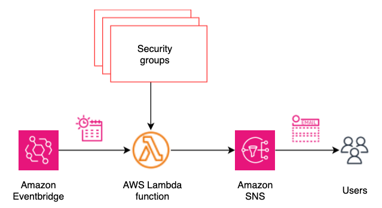
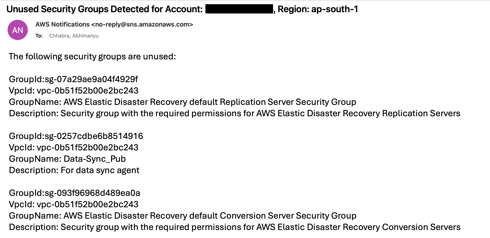

# Orphan Security Group notifier

## Overview

This repository contains a AWS CloudFormation template that deploys a solution for notifying all the orphan security groups over an email. The solution leverages various AWS services, including Amazon Lambda and Amazon Eventbridge, to schedule and analyze all the security groups in an account and region.

## Challenge
In cloud environments, particularly in AWS, security groups are essential for controlling inbound and outbound traffic to resources. However, as infrastructure evolves and resources are deleted or modified, some security groups may become "orphaned" - meaning they are no longer associated with any active resources. These orphaned security groups can pose several challenges:

- They clutter the environment, making it harder to manage and understand the current security posture.
- They may contain outdated or unnecessary rules, potentially creating security vulnerabilities if accidentally reused.
- They contribute to hitting service limits unnecessarily.

Identifying and managing these orphaned security groups manually can be time-consuming and error-prone, especially in large and dynamic environments.

## Solution
To address this challenge, an orphan security group notifier can be implemented with the following features:

- Automated Scanning: Regularly scan all security groups in the specified AWS accounts and regions.

- Association Check: For each security group, check if it's associated with any active resources such as EC2 instances, load balancers, RDS instances, etc.

- Notification System: Implement a notification system (e.g., using AWS SNS) to alert relevant teams or individuals about orphaned security groups.

By implementing this solution, organizations can maintain a cleaner, more secure, and more manageable cloud environment, reducing potential security risks and unnecessary costs associated with orphaned security groups.

## Architecture

  

The solution consists of the following components:
- Amazon Event Bridge Scheduler: Triggers the lambda function as per scheduler configuration.
- AWS Lambda Function: Orchestrates data collection and invokes Amazon SNS.
- Security groups: Information about all the unattached security groups in aws account and region.
- Amazon SNS: Sends the orphan security group details as an email report.

## Workflow

- The Amazon Event Bridge Scheduler triggers the AWS Lambda function daily (or as per schedule).
- The AWS Lambda function collects data from Security groups and analyzes for all the unattached security groups. Next, it uses SNS topic's subscription to send details over email.

## Prerequisites
Before deploying the solution, ensure that an existing SNS topic with subscription exists.

<b> Disclaimer: </b> This is sample code and users must conduct their own due diligence before deployment. It is strongly recommended to verify IAM permissions and follow the Pricinple of Least Privilege model.

https://docs.aws.amazon.com/IAM/latest/UserGuide/best-practices.html

## Deployment
Here are the steps to deploy the Solution using the provided CloudFormation template (find-unused-sg.yaml), along with a description of each parameter:

- Clone the repository Clone this repository to your local machine using the following command: `git clone https://github.com/aws-samples/sample-orphan-security-group-notifier.git`

- Navigate to the repository directory `cd sample-orphan-security-group-notifier`

- Create an AWS CloudFormation stack Open the AWS CloudFormation console and click on "Create stack" -> "With new resources (standard)"..

- Upload the CloudFormation template In the "Specify template" section, choose "Upload a template file" and select the `find-unused-sg.yaml` file from your local repository.

- Configure the parameters
In the "Specify stack details" section, provide the following parameters:
**ScheduleExpr** - Enter the schedule for lambda, use rate expressions. The default value triggers this every 12 hours. For more information https://docs.aws.amazon.com/AmazonCloudWatch/latest/events/ScheduledEvents.html#RateExpressions
**snsTopicArn** - SNS Topic Arn for sending notification for the unused security groups

- Review and deploy Review the parameter values and click "Next" to review the stack details. Finally, check the "I acknowledge that AWS CloudFormation might create IAM resources" box and click "Create stack" to deploy the solution.

## Benefits

- Unattached security groups can pose security risks if they are accidentally used or misconfigured. Daily notifications help you stay on top of any unattached security groups and address them promptly, reducing your attack surface.

- You can identify and remove any obsolete or unnecessary security groups before they become an issue.

- Automating the process of identifying unattached security groups saves time and effort compared to manual reviews.

- This data can be used for reporting and auditing purposes, supporting your overall AWS governance.

Overall, a solution that proactively notifies you of unattached security groups can greatly enhance your AWS security, and operational efficiency. It's a valuable tool for maintaining a well-organized and secure AWS environment.

## Sample email notification

  

